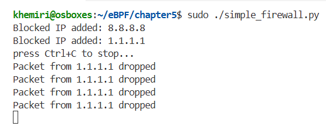
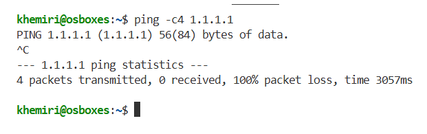

# 🔥 Simple eBPF Firewall with XDP

This project is a **simple firewall** built with **eBPF** and **XDP (eXpress Data Path)**.
It demonstrates how to **drop inbound packets from blocked source IPs** at the earliest stage in the Linux networking stack — right in the NIC driver.

The project includes:

* An eBPF program (`simple_firewall.c`) that:

  * Drops packets from blocked IPs.
  * Logs the source IPs of dropped packets to userspace.
* A Python loader (`simple_firewall.py`) using **BCC** to:

  * Compile and attach the eBPF program to a network interface.
  * Dynamically insert blocked IPs into the BPF map.
  * Print debug logs of dropped packets in real time.

---

## ⚡ Features

* Block traffic from specific **source IP addresses**.
* Log dropped packets using a **perf buffer**.
* Configure blocked IPs from userspace Python code.
* Runs at **XDP ingress**, so it is **very fast** (before iptables/nftables).

---

## 🛠️ Installation

First, install dependencies for compiling and running eBPF programs.

```bash
echo "[*] Installing eBPF build dependencies..."
sudo apt install -y clang \
    llvm \
    libbpf-dev \
    libelf-dev \
    build-essential \
    linux-headers-$(uname -r) \
    linux-tools-$(uname -r)

echo "[*] Installing BCC (BPF Compiler Collection) and Python bindings..."
sudo apt-get install -y bpfcc-tools \
    libbpfcc-dev \
    python3-bpfcc
```

---

## 🚀 Usage

1. **Clone the repo**:

   ```bash
   git clone https://github.com/khemiri22/ebpf-simple-firewall.git
   cd ebpf-simple-firewall
   ```

2. **Edit the Python script** (`simple_firewall.py `) to choose your network interface and blocked IP list:

   ```python
   INTERFACE = "enp0s3"
   block_list = ["8.8.8.8", "1.1.1.1"]
   ```

3. **Run the program** (requires root):

   ```bash
   sudo ./simple_firewall.py 
   ```

4. **Test it** by sending packets from a blocked IP (e.g., with `ping`).
   You should see logs like:

   ```
   Packet from 8.8.8.8 dropped
   ```

5. **Stop the program** with `Ctrl+C`.
   It will automatically **detach** the XDP program from the interface.

---

## 📂 Project Structure

```
.
├── simple_firewall.py  # Python loader (attaches XDP, manages maps, prints logs)
└── simple_firewall.c   # eBPF/XDP program (drops packets from blocked IPs)
```
---

## 📸 Results

When blocking traffic from `1.1.1.1` and running:

   ```bash
      ping -c4 1.1.1.1
   ```

➡️ **Firewall output** (Python userspace):
<div align="center">
  
</div>

➡️ **Ping result** (blocked traffic):
<div align="center">
  
</div>

---

## 📖 Notes

* Runs in **XDP mode** → only filters *incoming* traffic.
* Uses `BPF_HASH` to store blocked IPs. Userspace inserts IPs dynamically.
* `perf_submit` is used to notify userspace when a packet is dropped.

---

## 🧠 Credits

* Inspired by *Learning eBPF* by Liz Rice 📘
* Built during experiments with **BCC + eBPF** and some great late-night debugging sessions with ChatGPT 😅